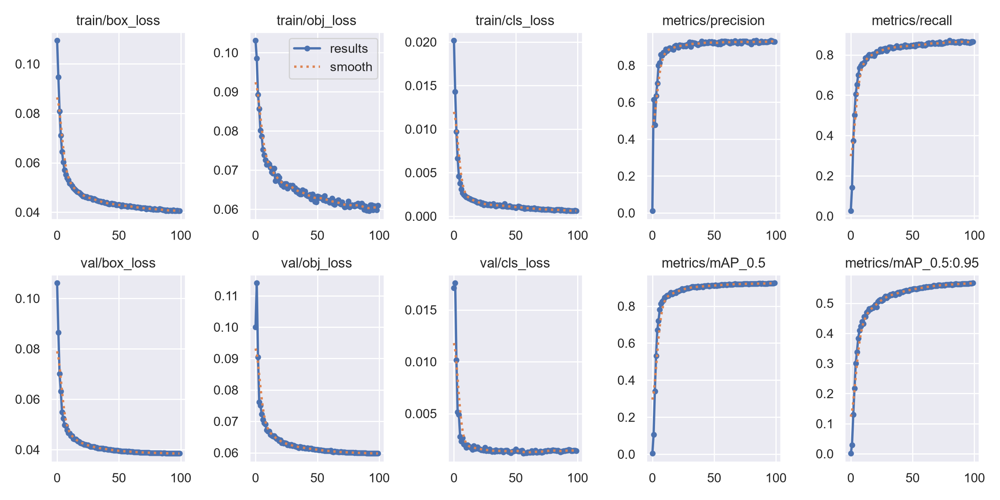
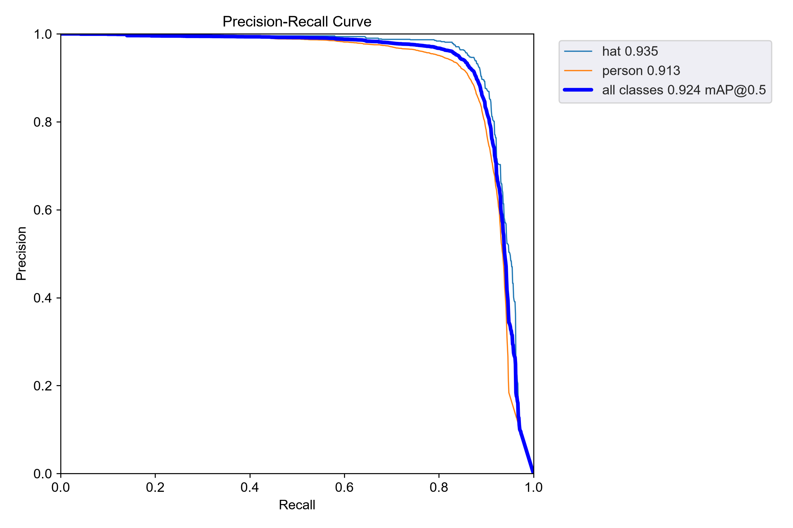
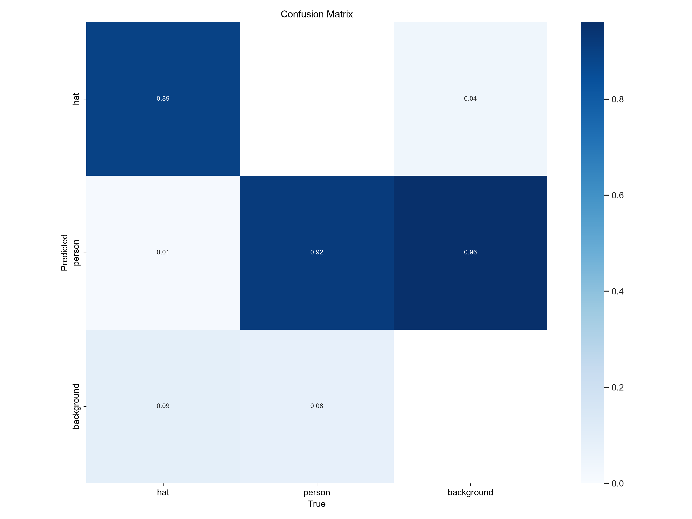

# YOLOv5s 基线与 MobileNetV2-YOLOv5 融合模型对比报告

## 1. 实验目的

在 SHWD 安全帽佩戴检测数据集上，将 YOLOv5s 的原始 Backbone 替换为 MobileNetV2 倒残差结构，比较轻量化带来的模型复杂度变化与检测精度变化。

## 2. 数据与实验设置

两组模型的验证集相同，均为 607 张图像、9,925 个目标实例，类别为 `hat` 和 `person`。输入尺寸均为 640 × 640，训练轮数均为 100。

| 项目 | YOLOv5s 基线 | MobileNetV2-YOLOv5 |
|---|---|---|
| Backbone | 原始 YOLOv5s Backbone | MobileNetV2 倒残差 Backbone |
| Neck / Head | YOLOv5 FPN+PAN / Detect | YOLOv5 FPN+PAN / Detect |
| 初始权重 | `yolov5s.pt` 预训练权重 | 空权重，从头训练 |
| batch size | 4 | 16 |
| workers | 0 | 0（恢复训练时） |
| 图像尺寸 | 640 × 640 | 640 × 640 |
| 训练轮数 | 100 | 100 |
| 验证集 | 607 images / 9,925 instances | 607 images / 9,925 instances |

> **可比性说明：** 基线模型使用了 COCO 预训练权重，而融合模型从头训练；同时两者 batch size 不同。因此，本报告中的精度差异可以描述为“当前实验设置下的结果”，但不能将其完全归因于 Backbone 替换。若要做严格消融实验，应统一初始化方式、batch size、随机种子和训练超参数。

## 3. 模型复杂度对比

| 模型 | 参数量 | GFLOPs | `best.pt` 大小 | 相对基线变化 |
|---|---:|---:|---:|---:|
| YOLOv5s 基线 | 7.016 M | 15.8 | 14.4 MB | - |
| MobileNetV2-YOLOv5 | 2.369 M | 6.4 | 5.1 MB | 参数量 -66.2%，GFLOPs -59.5%，权重 -64.6% |

融合模型将参数量减少约 4.65 M，计算量减少 9.4 GFLOPs，权重文件减少约 9.3 MB，具备更适合边缘设备部署的轻量化优势。

## 4. 验证集总体性能对比

| 模型 | Precision | Recall | mAP@0.5 | mAP@0.5:0.95 |
|---|---:|---:|---:|---:|
| YOLOv5s 基线 | 0.938 | 0.905 | 0.947 | 0.624 |
| MobileNetV2-YOLOv5 | 0.929 | 0.866 | 0.924 | 0.567 |
| 融合模型相对基线（绝对差值） | -0.009 | -0.039 | -0.023 | -0.057 |

当前融合模型的 mAP@0.5 为 **0.924**，在参数量降低 66.2% 的条件下，仍保留了基线约 97.6% 的 mAP@0.5。精度下降主要体现在 Recall 和更严格的 mAP@0.5:0.95，说明轻量化 Backbone 对目标召回与边界框定位精度有一定影响。

## 5. 各类别性能对比

| 类别 | 模型 | Precision | Recall | mAP@0.5 | mAP@0.5:0.95 |
|---|---|---:|---:|---:|---:|
| hat | YOLOv5s 基线 | 0.941 | 0.916 | 0.954 | 0.754 |
| hat | MobileNetV2-YOLOv5 | 0.940 | 0.877 | 0.935 | 0.678 |
| person | YOLOv5s 基线 | 0.935 | 0.895 | 0.940 | 0.494 |
| person | MobileNetV2-YOLOv5 | 0.916 | 0.855 | 0.913 | 0.455 |

`hat` 类在两种模型上都优于 `person` 类的严格定位指标；融合模型的 `hat` 类 mAP@0.5:0.95 下降 0.076，而 `person` 类下降 0.039。后续可重点检查小目标、遮挡和密集场景下的漏检情况。

## 6. 本次融合模型训练结果

训练在 NVIDIA GeForce RTX 5060 Ti 上完成，最终使用 `best.pt` 验证：

```text
Class     Images  Instances      P       R    mAP@0.5  mAP@0.5:0.95
all          607       9925   0.928   0.866    0.924       0.567
hat          607        747   0.940   0.877    0.935       0.678
person       607       9178   0.916   0.855    0.913       0.455
```

训练曲线：



Precision-Recall 曲线：



混淆矩阵：



## 7. 结论

1. 使用 MobileNetV2 替换 YOLOv5s Backbone 后，模型参数量由 7.016 M 降至 2.369 M，减少 **66.2%**；计算量由 15.8 GFLOPs 降至 6.4 GFLOPs，减少 **59.5%**。
2. 融合模型在验证集上达到 0.924 mAP@0.5 和 0.567 mAP@0.5:0.95，说明其仍具备较好的安全帽检测能力。
3. 与基线相比，融合模型的 mAP@0.5 降低 0.023、mAP@0.5:0.95 降低 0.057；这体现了轻量化与精度之间的权衡。
4. 若部署资源受限（如边缘端、嵌入式设备），MobileNetV2-YOLOv5 是具有实际价值的轻量化方案；若优先追求最高检测精度，当前实验中的 YOLOv5s 基线更优。

## 8. 后续工作建议

1. 使用融合模型的 `best.pt` 在与基线相同的 1,517 张 test 集上评估，补齐严格的测试集对比。
2. 统一两组实验的初始化方式、batch size、训练超参数和随机种子，进行公平消融对比。
3. 尝试加载或迁移 MobileNetV2 预训练权重，并与从头训练结果对比。
4. 可进一步加入注意力模块（如 ECA）或调整特征融合层，重点提升 `person` 类的 Recall 与 mAP@0.5:0.95。

## 9. 组会汇报可直接使用的表述

在 SHWD 验证集上，本文以 YOLOv5s 为基线，将其 Backbone 替换为 MobileNetV2。实验结果表明，融合模型的参数量和计算量分别降低 66.2% 和 59.5%，权重文件缩小至 5.1 MB；同时取得 0.924 的 mAP@0.5 和 0.567 的 mAP@0.5:0.95。相较于基线模型，融合模型存在一定精度下降，但显著降低了模型复杂度，体现出在边缘设备部署场景中的应用潜力。
